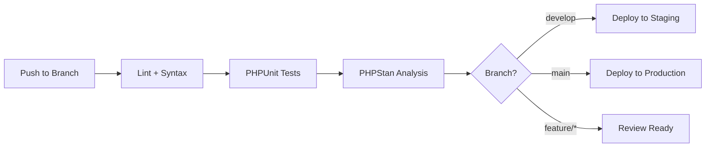

# CI/CD Pipeline — OpenXE

> Build-, Test- und Deployment-Konfiguration.

## Lokale Entwicklungsumgebung

### Voraussetzungen

| Tool | Version | Zweck |
|------|---------|-------|
| PHP | 8.5+ | Runtime |
| Composer | 2.x | PHP Dependencies |
| Node.js | 18+ | Frontend Build |
| npm | 9+ | JS Dependencies |
| MySQL/MariaDB | 8.0+ / 10.6+ | Datenbank |

### Ersteinrichtung

```bash
# 1. Dependencies installieren
composer install
npm install

# 2. Konfiguration
cp conf/userdata_example.php conf/userdata.php
# → Datenbank-Zugangsdaten eintragen

# 3. Datenbank erstellen
mysql -u root -p < database/struktur.sql
mysql -u root -p < database/beispiel.sql  # Optional: Testdaten

# 4. Dev-Server starten
php -S localhost:8080 -t www/
```

## Qualitätssicherung (lokal)

```bash
# Syntax-Check aller geänderten PHP-Dateien
find . -name "*.php" -newer .git/FETCH_HEAD | xargs -I {} php -l {}

# PHPUnit Tests
./vendor/bin/phpunit

# PHPUnit mit Coverage
./vendor/bin/phpunit --coverage-html coverage/

# PHPStan (Static Analysis, falls konfiguriert)
./vendor/bin/phpstan analyse classes/ --level=5

# Frontend Build
npm run build
```

## Pre-Commit Checkliste

Vor jedem Commit diese Schritte ausführen:

```bash
# 1. Syntax-Check
php -l <geänderte-dateien>

# 2. Tests
./vendor/bin/phpunit

# 3. Changelog aktualisieren
# → .ai/changelog/CHANGELOG.md

# 4. Commit mit Conventional Commit Message
git commit -m "feat(artikel): add ArticleRepository with prepared statements"
```

## Docker

Die Docker-Konfiguration befindet sich in:
- `docker-compose.yml` — Service-Definitionen
- `docker-compose.override.example.yml` — Lokale Overrides
- `docker/` — Dockerfiles und Konfigurationen

```bash
# Docker-Umgebung starten
docker-compose up -d

# Logs anzeigen
docker-compose logs -f
```

## Deployment

> [!WARNING]
> Deployment-Prozess ist aktuell noch nicht automatisiert.
> Geplant: CI/CD Pipeline nach Abschluss von Phase 0 (PHP 8.5 Merge).

### Geplante Pipeline-Struktur



## API-Dokumentation

> [!NOTE]
> Es existieren externe Repositories mit API-Dokumentation.
> Details werden nachgereicht sobald die Repository-URLs verfügbar sind.
