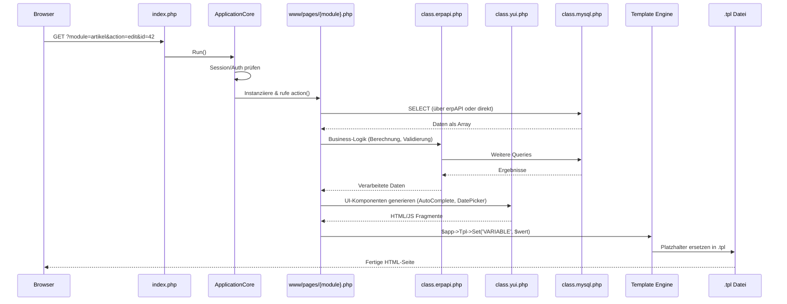
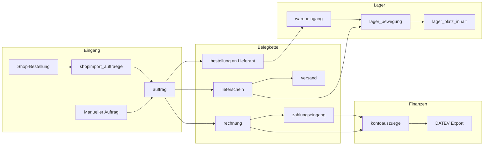
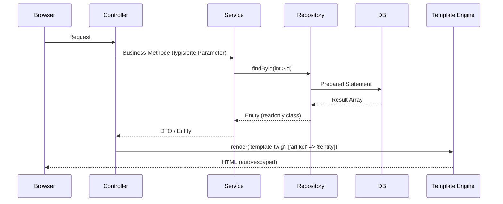

# Datenfluss — OpenXE ERP

> Wie Daten durch das System fließen: vom HTTP-Request bis zur Datenbank und zurück.

## Request → Response Lifecycle



## Datenfluss bei Belegverarbeitung



## Daten-Formate im Code

### Eingangsdaten (User Input)
```php
// GET-Parameter
$id = $this->app->Secure->GetGET('id');         // string, "sanitized"
$action = $this->app->Secure->GetGET('action'); // string

// POST-Formulardaten
$input = $this->app->Secure->GetPOST('bezeichnung'); // string
// oder als Array:
$data = $_POST;  // ⚠️ unsanitized, Legacy-Pattern
```

### Interne Daten (zwischen Schichten)
```php
// Daten werden als assoziative Arrays herumgereicht:
$artikel = $this->app->DB->SelectArr("SELECT * FROM artikel WHERE id = :id", ['id' => $id]);
// Ergebnis: [['id' => 42, 'nummer' => 'ART-001', 'bezeichnung' => 'Widget', ...]]

// Einzelner Datensatz:
$row = $artikel[0];  // Array mit ~250 Keys für Artikel

// ⚠️ Kein Typ-System, kein DTO — reine Arrays
// Felder wie $row['ustfrei'], $row['umsatzsteuer'], $row['steuersatz']
// müssen aus dem Schema oder Code erschlossen werden
```

### Ausgangsdaten (Template)
```php
// Daten werden als Strings in Template-Platzhalter gesetzt:
$this->app->Tpl->Set('ARTIKELNAME', htmlspecialchars($row['bezeichnung']));
$this->app->Tpl->Set('PREIS', number_format($row['preis'], 2, ',', '.'));

// JavaScript wird als String injiziert:
$this->app->Tpl->Add('JAVASCRIPT', "var artikelId = {$row['id']};");
```

## Ziel-Datenfluss (nach Modernisierung)



> [!NOTE]
> Im Ziel-Zustand fließen **typisierte Objekte** (Entities/DTOs) statt roher Arrays durch die Schichten. Templates escapen automatisch, und JavaScript erhält Daten über `data-*` Attribute statt PHP-Stringkonkatenation.
