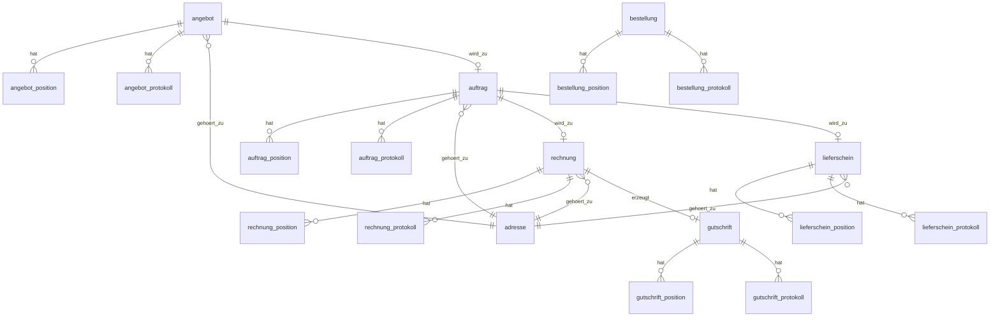

# Datenbank-Schema — OpenXE ERP

> Übersicht der MySQL/MariaDB Datenbankstruktur.
> Quelle: [database/struktur.sql](file:///c:/Users/3D%20Partner/Documents/openxe_rework/OpenXE/database/struktur.sql)

## Statistik

| Kennzahl | Wert |
|----------|------|
| Tabellen gesamt | **601** |
| Schema-Datei | `database/struktur.sql` |
| Beispieldaten | `database/beispiel.sql` |

## Kern-Domänen und ihre Tabellen

### Belegwesen (Documents)

Die Belegkette ist das Herzstück des ERP-Systems.

| Tabelle | Positions-Tabelle | Protokoll | Beschreibung |
|---------|-------------------|-----------|--------------|
| `angebot` | `angebot_position` | `angebot_protokoll` | Angebot/Quote |
| `auftrag` | `auftrag_position` | `auftrag_protokoll` | Verkaufsauftrag |
| `rechnung` | `rechnung_position` | `rechnung_protokoll` | Ausgangsrechnung |
| `lieferschein` | `lieferschein_position` | `lieferschein_protokoll` | Lieferschein |
| `gutschrift` | `gutschrift_position` | `gutschrift_protokoll` | Gutschrift |
| `bestellung` | `bestellung_position` | `bestellung_protokoll` | Einkaufsbestellung |
| `preisanfrage` | `preisanfrage_position` | `preisanfrage_protokoll` | Preisanfrage |
| `retoure` | `retoure_position` | `retoure_protokoll` | Retoure |
| `proformarechnung` | `proformarechnung_position` | `proformarechnung_protokoll` | Proformarechnung |

> **Pattern:** Jeder Belegtyp hat 3 Tabellen: Kopfdaten, Positionen (*_position), Protokoll (*_protokoll).

---

### Artikelverwaltung (Articles/Products)

| Tabelle | Beschreibung |
|---------|--------------|
| `artikel` | Stammdaten aller Artikel (~250 Spalten!) |
| `artikel_freifelder` | Benutzerdefinierte Felder |
| `artikel_onlineshops` | Shop-spezifische Artikeldaten |
| `artikel_texte` | Mehrsprachige Texte |
| `verkaufspreise` | Staffelpreise und Kundenpreise |
| `einkaufspreise` | Lieferantenpreise |
| `stueckliste` | Stücklisten (Bill of Materials) |
| `eigenschaften` | Artikeleigenschaften |
| `seriennummern` | Seriennummernverwaltung |
| `matrixprodukt_*` | Variantenartikel (4 Tabellen) |

---

### Lagerverwaltung (Warehouse)

| Tabelle | Beschreibung |
|---------|--------------|
| `lager` | Lager-Stammdaten |
| `lager_platz` | Lagerplätze |
| `lager_platz_inhalt` | Bestand pro Platz |
| `lager_bewegung` | Lagerbewegungen (Ein-/Ausgang) |
| `lager_reserviert` | Reservierte Bestände |
| `lager_charge` | Chargen-Tracking |
| `lager_seriennummern` | Seriennummern auf Lagerplätzen |
| `lager_mindesthaltbarkeitsdatum` | MHD-Tracking |
| `inventur` / `inventur_position` | Inventur |
| `kommissionierung` / `*_position` | Kommissionierung |

---

### Adressen / CRM

| Tabelle | Beschreibung |
|---------|--------------|
| `adresse` | Kunden, Lieferanten, Partner (Typ-Feld unterscheidet) |
| `ansprechpartner` | Kontaktpersonen zu Adressen |
| `adresse_abteilungen` | Abteilungen |
| `adresse_kontakte` | Kommunikationskanäle |
| `lieferadressen` | Abweichende Lieferadressen |
| `wiedervorlage` | CRM Wiedervorlage/Follow-ups |
| `wiedervorlage_aufgabe` | Aufgaben zu Wiedervorlagen |

---

### Shop-Integration

| Tabelle | Beschreibung |
|---------|--------------|
| `shopexport` | Shop-Konfigurationen (WooCommerce, Shopify, etc.) |
| `shopexport_artikel` | Artikel-Shop-Zuordnung |
| `shopexport_kategorien` | Kategorien-Mapping |
| `shopexport_log` | Import/Export-Protokoll |
| `shopimport_auftraege` | Importierte Bestellungen |
| `shopexport_versandarten` | Versandarten-Mapping |
| `shopexport_zahlweisen` | Zahlweisen-Mapping |
| `shopimporter_amazon_*` | Amazon-spezifisch (30+ Tabellen) |

---

### Finanzen

| Tabelle | Beschreibung |
|---------|--------------|
| `kontorahmen` | Kontenrahmen (SKR03/SKR04) |
| `konten` | Buchungskonten |
| `kontoauszuege` | Bank-Kontoauszüge |
| `kontoauszuege_zahlungseingang` | Zahlungseingänge |
| `kontoauszuege_zahlungsausgang` | Zahlungsausgänge |
| `steuersaetze` | Steuersätze |
| `verbindlichkeit` / `*_position` | Eingangsrechnungen |
| `mahnwesen` | Mahnungen |
| `kostenstelle` / `*_buchung` | Kostenstellenrechnung |

---

### System & Konfiguration

| Tabelle | Beschreibung |
|---------|--------------|
| `user` | Benutzer |
| `userrights` | Benutzerrechte |
| `firma` | Firmenstammdaten |
| `firmendaten` | Erweiterte Firmendaten |
| `konfiguration` | Systemeinstellungen |
| `prozessstarter` | Cronjob-Definitionen |
| `module_status` | Aktive/inaktive Module |
| `systemlog` | System-Protokoll |
| `systemhealth` | Systemüberwachung |

---

## Benennungspattern

| Pattern | Bedeutung | Beispiel |
|---------|-----------|---------|
| `{entity}` | Kopfdaten | `auftrag` |
| `{entity}_position` | Positionsdaten | `auftrag_position` |
| `{entity}_protokoll` | Änderungshistorie | `auftrag_protokoll` |
| `{entity}_freifelder` | Custom Fields | `artikel_freifelder` |
| `shopexport_*` | Shop-Einstellungen | `shopexport_versandarten` |
| `shopimporter_*_*` | Shop-Import-Daten | `shopimporter_amazon_listing` |
| `lager_*` | Lagerbezogen | `lager_bewegung` |

## Wichtige Beziehungen

- Belege → `adresse` über `adresse` FK (Spaltenname: `adresse`)
- Positionen → `artikel` über `artikel` FK (Spaltenname: `artikel`)
- Belege untereinander über `auftragid`/`rechnungid`/etc. (direkte FK-Spalten)
- `projekt` als Querschnitt-Zuordnung in vielen Belegen

> [!WARNING]
> Viele Beziehungen sind **nicht als Foreign Keys** im Schema definiert, sondern nur über Konvention (gleichnamige Spalten). Dies muss bei Repository-Implementierungen berücksichtigt werden.
