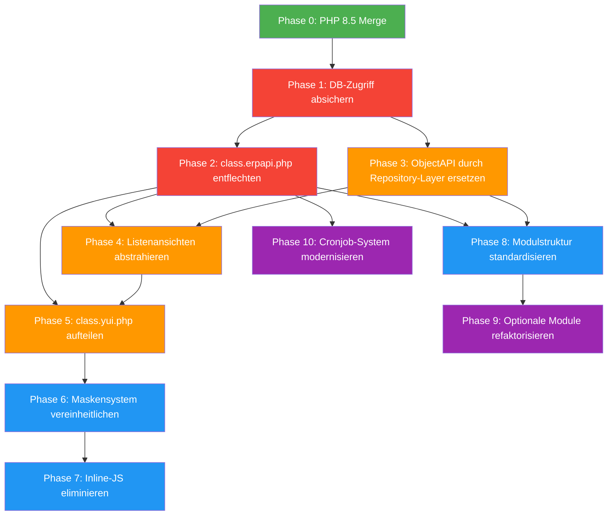

# OpenXE Modernisierungs-Roadmap

Priorisiert nach Abhängigkeiten — jede Phase baut auf der vorherigen auf.
Team: 2–3 KI-Entwickler | Ziel-PHP: 8.5 | System bleibt lauffähig während des Umbaus.

---

## Abhängigkeitsgraph


> 🟥 Kritisch/Sicherheit  🟧 Strukturell  🟦 UI/Frontend  🟪 Infrastruktur

---

## Phase 0: PHP 8.5 Merge *(Voraussetzung für alles)*

**Warum zuerst:** Alle neuen Klassen und Refactorings sollen von Anfang an PHP 8.5 Features nutzen (Enums, Readonly Properties, Typed Properties, Named Arguments, Intersection Types). Rückwärts-Migration wäre extrem aufwändig.

**Aufgabe:**
- Bestehendes PHP-8.5-Kompatibilitäts-Repo mergen
- CI/Lint sicherstellen: gesamtes Projekt fehlerfrei unter PHP 8.5
- Composer-Dependencies aktualisieren (bereits in vorherigem Gespräch geprüft)

**Abhängigkeit:** Keine — kann sofort starten.

**Ergebnis:** Lauffähiges System auf PHP 8.5, Basis für alle weiteren Phasen.

---

## Phase 1: Datenbankzugriff absichern *(Sicherheitskritisch)*

**Warum als erstes nach PHP 8.5:** SQL-Injection ist das gefährlichste offene Problem. Jede weitere Refaktorisierung erzeugt neuen Code, der von Anfang an sicher sein muss. Der neue DB-Layer wird die Grundlage für alle nachfolgenden Phasen.

**Aufgabe:**
- [class.mysql.php](file:///c:/Users/3D%20Partner/Documents/openxe_rework/OpenXE/phpwf/plugins/class.mysql.php) erweitern:
  - PDO-Wrapper mit Prepared Statements (`preparedSelect()`, `preparedInsert()`, etc.)
  - Bestehende Methoden (`Select()`, `SelectArr()`, etc.) **bleiben erhalten** (Abwärtskompatibilität)
  - Neuer Code nutzt ausschließlich die neuen Methoden
- Meistgenutzte Queries in `www/pages/` priorisiert auf Prepared Statements umstellen (besonders user-input-nahe: `GetGET`/`GetPOST`-basierte)
- Einfaches Query-Builder-Interface für häufige Patterns (SELECT mit WHERE, INSERT, UPDATE)

**Abhängigkeit:** Phase 0 (PHP 8.5 für Typed Properties, Enums für Query-Typen)

**Ergebnis:** Sichere DB-Methoden verfügbar, alte Methoden weiterhin funktional, neue Queries parameterisiert.

---

## Phase 2: `class.erpapi.php` entflechten *(Strukturell — Kern-Blocker)*

**Warum vor allem anderen:** Fast jede Datei im Projekt nutzt `$app->erp->...`. Solange diese **39.520-Zeilen-God-Class** existiert, ist keine saubere Modultrennung möglich. Alle späteren Phasen (Listenansichten, Widgets, Module) hängen davon ab, dass Business-Logik in klaren Domain-Services liegt.

**Aufgabe:**
1. **Katalogisierung:** Alle 1.038 Methoden kategorisieren (anhand der vorhandenen `@refactor`-Tags und Namensanalyse):
   - Belegwesen (Auftrag, Rechnung, Lieferschein, Gutschrift)
   - Artikelverwaltung
   - Lagerverwaltung
   - Shop-Integration
   - Adress-/Kundenverwaltung
   - Navigation/Hooks
   - Cronjob-Management
   - PDF/Export
   - Steuern/Finanzen
   - Utilities/Deprecated

2. **Pro Domain ein Service-Klasse erstellen** in `classes/Components/` oder `classes/Services/`:
   ```
   classes/Services/
   ├── DocumentService.php      (Belege)
   ├── ArticleService.php       (Artikel)
   ├── WarehouseService.php     (Lager)
   ├── ShopService.php          (Shop-Integration)
   ├── NavigationService.php    (Menü/Hooks)
   ├── TaxService.php           (Steuern)
   └── ...
   ```

3. **Facade-Pattern:** `erpAPI` delegiert nur noch an Services — alle Methoden bleiben aufrufbar, kein Breaking Change. Neue Code-Stellen referenzieren direkt die Services.

4. **Sukzessiver Abbau:** Nach und nach direkte Service-Nutzung statt erpAPI-Aufrufe.

**Abhängigkeit:** Phase 1 (Services nutzen den neuen sicheren DB-Layer)

**Ergebnis:** Business-Logik in testbaren Service-Klassen, `erpAPI` wird zur dünnen Facade.

---

## Phase 3: ObjectAPI durch Repository-Layer ersetzen

**Warum jetzt:** Die 183 generierten ObjectAPI-Dateien sind der zweite große Quelle unsicherer SQL-Queries und machen jede DB-Schema-Änderung extrem aufwändig (pro Feld: Property, Select-Mapping, Insert-Mapping, Update-Mapping, Delete-Reset — 5 Änderungen).

**Aufgabe:**
- **Repository-Pattern** einführen (ein Repository pro Entität):
  ```
  classes/Repository/
  ├── ArtikelRepository.php
  ├── AuftragRepository.php
  ├── AdresseRepository.php
  └── ...
  ```
- Repositories nutzen den sicheren DB-Layer aus Phase 1
- PHP 8.5 Readonly-Klassen als Entity/DTO-Ersatz für die bisherigen Property-Monster
- Schrittweise Migration: Neue Repositories parallel zu bestehender ObjectAPI, Widgets und Pages schrittweise umstellen
- Generator-Skript erstellen, das aus DB-Schema automatisch Repository-Grundgerüste erzeugt (da der alte Generator unbekannt ist)

**Abhängigkeit:** Phase 1 (Prepared Statements als Basis)

**Ergebnis:** Typisierte Entitäten, ein einzelner Änderungspunkt pro Datenbankfeld, sichere Queries.

---

## Phase 4: Listenansichten abstrahieren

**Warum jetzt:** Jedes der 147 Module hat eine eigene `TableSearch()`-Methode mit repetitivem Boilerplate (Headings, Columns, SQL, Menu-HTML). Die Abstraktion erfordert, dass die DB-Services (Phase 2/3) und der sichere DB-Layer (Phase 1) stehen.

**Aufgabe:**
- **Deklarative Listenkonfiguration** statt imperativem Code:
  ```php
  // Vorher: 50-100 Zeilen pro case in TableSearch()
  // Nachher: Konfigurationsarray
  return [
      'columns'  => [...],
      'query'    => ArtikelRepository::listQuery($filters),
      'actions'  => ['edit', 'copy', 'delete'],
      'filters'  => [...],
  ];
  ```
- **ListRenderer-Klasse** die aus der Konfiguration HTML generiert (statt SQL-CONCATs)
- HTML-Generierung für Icons/Menüs **komplett aus SQL entfernen** und in den Renderer verlagern
- Schrittweise: Modul für Modul umstellen, altes Pattern bleibt funktional

**Abhängigkeit:** Phase 2 (Services für Queries), Phase 3 (Repositories für Daten)

**Ergebnis:** Ein einheitliches Listensystem, Module definieren nur noch *was*, nicht *wie*.

---

## Phase 5: `class.yui.php` aufteilen

**Warum jetzt:** Erst wenn die Listenansichten abstrahiert sind (Phase 4) und die erpAPI-Methoden in Services liegen (Phase 2), können die 15.983 Zeilen sinnvoll zerlegt werden — vorher würde man Abhängigkeiten hin- und herschieben.

**Aufgabe:**
- Aufteilung nach Verantwortlichkeit:
  ```
  classes/Components/UI/
  ├── AutoComplete.php
  ├── DatePicker.php
  ├── CkEditor.php
  ├── Dialog.php
  ├── DocumentPositions.php  (AARLGPositionen — 1.633 Zeilen)
  ├── StatusIcons.php        (IconsSQL — 221 Zeilen)
  ├── TableFormatter.php
  └── ...
  ```
- `AARLGPositionen()` (die 1.633-Zeilen-Methode) als eigene Klasse mit Unter-Methoden
- `YUI`-Klasse wird zur Facade (wie erpAPI in Phase 2)

**Abhängigkeit:** Phase 4 (Listenansichten getrennt), Phase 2 (erpAPI entflechtet)

**Ergebnis:** Wartbare, testbare UI-Komponenten statt einer monolithischen Klasse.

---

## Phase 6: Maskensystem vereinheitlichen

**Warum jetzt:** Erst wenn YUI aufgeteilt ist (Phase 5), die Repositories existieren (Phase 3) und die Services stehen (Phase 2), kann ein einheitliches Formular-System implementiert werden.

**Aufgabe:**
- **Entscheidung für ein Template-System:** Twig (moderne Standard-Wahl, Symfony-kompatibel falls später relevant) oder verbessertes internes System
- Widget-System refaktorisieren: Formular-Definition per Konfiguration:
  ```php
  // Vorher: 44 AutoComplete-Aufrufe + 28 ReplaceFunction-Aufrufe
  // Nachher: Deklarative Feld-Definition
  'fields' => [
      'projekt'   => ['type' => 'autocomplete', 'source' => 'projektname'],
      'adresse'   => ['type' => 'autocomplete', 'source' => 'lieferant', 'replace' => 'ReplaceLieferant'],
      'gueltigbis' => ['type' => 'datepicker'],
  ]
  ```
- HTML-Kommentar-Toggles (`<!-- -->`) durch echte Conditional-Rendering ersetzen
- `.tpl`-Templates schrittweise in neues System migrieren

**Abhängigkeit:** Phase 5 (YUI-Komponenten), Phase 3 (Repositories für Form-Data)

**Ergebnis:** Ein Formular-/Maskensystem, das ein neues Feld mit einer einzigen Konfigurationszeile ermöglicht.

---

## Phase 7: Inline-JS eliminieren

**Warum jetzt:** Erst wenn Maskensystem (Phase 6) und Listenansichten (Phase 4) abstrahiert sind, wird klar, welcher JS-Code tatsächlich gebraucht wird und welcher redundant ist.

**Aufgabe:**
- Alle `$app->Tpl->Add('JAVASCRIPT', ...)` und `$app->Tpl->Add('JQUERYREADY', ...)` Aufrufe inventarisieren
- JS-Code in eigenständige `.js`-Dateien extrahieren (pro Modul oder Funktionsbereich)
- PHP-Variablen via `data-*` Attribute oder JSON-Blöcke (`<script type="application/json">`) übergeben statt String-Konkatenation
- jQuery DataTables-Filter-Funktionen (`fnFilterColumn1`, etc.) durch einheitlichen Ansatz ersetzen

**Abhängigkeit:** Phase 6 (Maskensystem), Phase 4 (Listenansichten)

**Ergebnis:** Nachvollziehbarer, wartbarer JS-Code; kein PHP-generiertes JavaScript mehr.

---

## Phase 8: Modulstruktur standardisieren

**Warum jetzt:** Die Services (Phase 2), Repositories (Phase 3) und UI-Abstraktionen (Phase 4–6) bilden die Bausteine. Jetzt kann eine einheitliche Modulstruktur definiert werden.

**Aufgabe:**
- **Standardstruktur** pro Modul definieren:
  ```
  classes/Modules/{ModulName}/
  ├── Controller/          (HTTP-Handling, ersetzt www/pages/{modul}.php)
  ├── Service/             (Business-Logik)
  ├── Repository/          (DB-Zugriff)
  ├── Templates/           (Twig/TPL)
  ├── Assets/              (modul-spezifisches JS/CSS)
  └── {ModulName}Module.php  (Registrierung)
  ```
- Bestehende Module (`www/pages/*.php`) schrittweise in diese Struktur migrieren
- Klare Schnittstellen zwischen Modulen (kein direkter DB-Zugriff über Modulgrenzen)

**Abhängigkeit:** Phase 2 (Services), Phase 3 (Repositories)

**Ergebnis:** Einheitliche Modulstruktur, die das Onboarding neuer Entwickler drastisch vereinfacht.

---

## Phase 9: Optionale Module refaktorisieren

**Warum jetzt:** Erst mit standardisierter Modulstruktur (Phase 8) und Services (Phase 2) kann das Feature-Flag-System sauber implementiert werden.

**Aufgabe:**
- `ModulVorhanden()`-Prüfungen durch ein Event-/Hook-System ersetzen
- Optionale Module registrieren sich aktiv (statt dass der Core alle möglichen Module abfragt)
- UI-Bereiche über Slots/Sections statt HTML-Kommentar-Toggles steuerbar

**Abhängigkeit:** Phase 8 (Modulstruktur)

**Ergebnis:** Module sind wirklich modular — Aktivierung/Deaktivierung ohne Code-Änderung im Core.

---

## Phase 10: Cronjob-System modernisieren

**Warum jetzt:** Benötigt die Services aus Phase 2 und kann dann parallel zu Phase 8/9 umgesetzt werden.

**Aufgabe:**
- Einheitlicher Worker-Prozess statt `starter.php` + `starter2.php`
- Echtes Locking (Filesystem-Locks oder DB Advisory Locks statt `mutexcounter`)
- Logging/Monitoring pro Task
- Optional: Symfony Messenger oder eigenständiges Queue-System
- Retry-Mechanismus und Error-Recovery

**Abhängigkeit:** Phase 2 (Services für Business-Logik in Jobs)

**Ergebnis:** Zuverlässiges, überwachbares Job-System.

---

## Parallelisierungsplan für 2–3 KI-Entwickler

| Zeitraum | Entwickler 1 | Entwickler 2 | Entwickler 3 |
|---|---|---|---|
| **Start** | Phase 0 (PHP 8.5 Merge) | — | — |
| **Danach** | Phase 1 (DB-Layer) | — | — |
| **Dann** | Phase 2 (erpAPI) | Phase 3 (ObjectAPI/Repos) | — |
| **Dann** | Phase 4 (Listenansichten) | Phase 3 fortsetzen | Phase 10 (Cronjobs) |
| **Dann** | Phase 5 (YUI aufteilen) | Phase 8 (Modulstruktur) | Phase 10 fortsetzen |
| **Dann** | Phase 6 (Maskensystem) | Phase 8 fortsetzen | Phase 7 (Inline-JS) |
| **Dann** | Phase 9 (Optionale Module) | Phase 7 fortsetzen | QA/Testing |

> [!IMPORTANT]
> Phase 0 und Phase 1 sind **sequenziell und blocken alles**. Erst ab Phase 2/3 ist echte Parallelisierung möglich.
